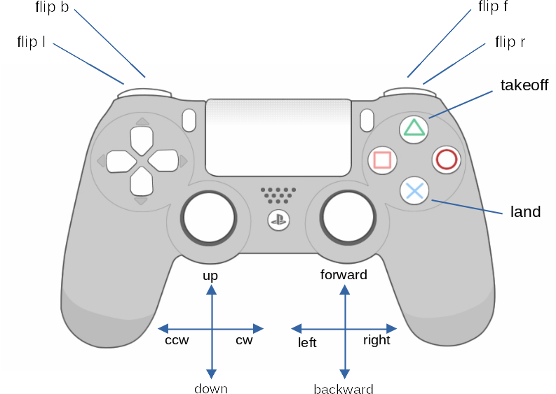

# CTello
CTello is a C++ library to interact with the **DJI Ryze Tello Drone** using the
**Tello SDK 2.0**.
The purpose of this project is to encapsulate the UDP socket communication and
provide a clean and easy-to-use interface to control the drone. However, CTello
has no clutter that might hide parts of the Tello communication protocol, or
restrict the interaction with the device in any way. CTello is transparent to
the commands that are sent or responses that are received and gives full
control to the user over the drone.


See the [Tello SDK 2.0 User Guide](https://dl-cdn.ryzerobotics.com/downloads/Tello/Tello%20SDK%202.0%20User%20Guide.pdf)

## Dependencies
This project was developed and tested with the versions listed below.

| Name        | Version                |
|-------------|:----------------------:|
|C++          | 17                     |
|C++ compiler | GCC 9.3.0, Clang 9.0.1 |
|CMake        | 3.17                   |
|spdlog       | 1.5.0-1                |
|OpenCV       | 4.2.0-2                |

## Build & install

Clone the repository:
```
git clone git@github.com:carlospzlz/ctello.git
```

Build it:
```
mkdir build
cd build
cmake ..
make -j
```

Install it:
```
sudo make install
```
This will install the library plus some tools in `/usr/local`.

## Quickstart

Now you can write a very simple program like this:

```c++
#include "ctello.h"

int main()
{
    ctello::Tello tello;
    if (!tello.Bind())
    {
        return 0;
    }

    tello.SendCommand("takeoff");
    // Wait for response
    while (!(tello.ReceiveResponse()));

    tello.SendCommand("flip b");
    while (!(tello.ReceiveResponse()));

    tello.SendCommand("land");
    while (!(tello.ReceiveResponse()));

    return 0;
}
```
Build it:
```
g++ -std=c++17 -I/usr/local/include -L/usr/local/lib flip_world.cpp -lctello -o flip-world
```

Switch on your Tello and connect to its Wi-Fi.

Run your **flip-world** (you may need to add `/usr/local/lib` to your
`LD_LIBRARY_PATH`):
```
./flip-world
```

You can also enable logging output to see in detail what's going on:
```
env SPDLOG_LEVEL=debug ./flip-world
```

## CTello executables

This project includes some executables built on top of the CTello library.

### ctello-command

Emulates a command line interpreter to send commands to the drone.

[](https://youtu.be/oCv5PHMtE3U)

### ctello-state

Receives the state of the drone and shows a table with the different fields.

[](https://youtu.be/n3GP9yxDCek)

### ctello-stream

Receives the video stream from the drone and displays it in an OpenCV window.

### ctello-joystick

Allows to send commands to the drone using a PlayStation DualShock 4
controller. This is implemented using the Linux Joystick API.



## CTello examples

Two examples are included.

### flip

Very simple example, similar to the previous **flip-world**.

### follow

This example shows case how image processing can be used to drive the drone's
actions.
Here, we try to follow a light by steering the drone towards it.

[](https://youtu.be/DtjBLWju8Jw)
